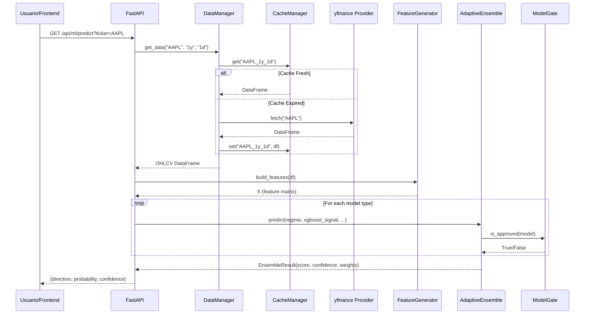
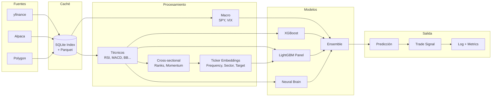
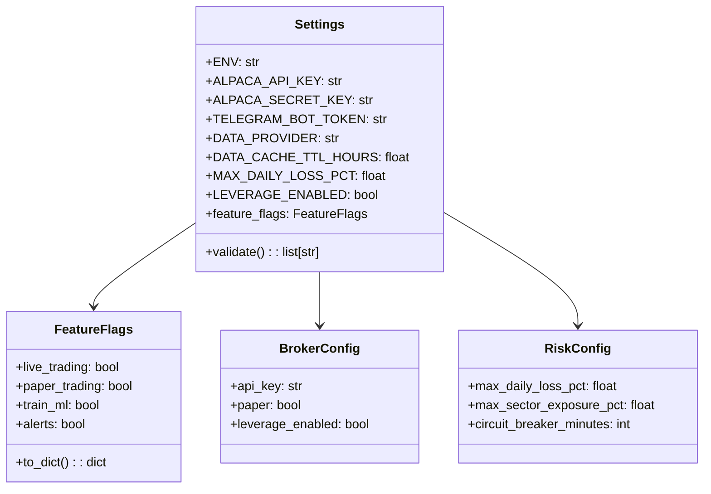
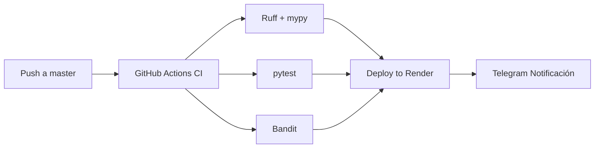

# Arquitectura del Sistema

## Diagrama de Alto Nivel

```mermaid
graph TB
    subgraph "Data Layer"
        YF[yfinance Provider]
        AL[Alpaca Provider]
        PL[Polygon Provider]
        CM[CacheManager<br/>SQLite + Parquet]
        SA[SplitAdjuster]
        DM[DataManager<br/>Failover Chain]
        YF --> CM
        AL --> CM
        PL --> CM
        CM --> SA
        YF --> DM
        AL --> DM
        PL --> DM
    end

    subgraph "Feature Engineering"
        FG[FeatureGenerator<br/>20+ features técnicas]
        PFG[PanelFeatureGenerator<br/>Cross-sectional features<br/>Ticker embeddings]
    end

    subgraph "Modelos ML"
        XGB[XGBoost<br/>Por ticker]
        LGB[LightGBM<br/>Panel Model]
        NN[Neural Brain<br/>PyTorch]
        RL[RL Agent<br/>Q-Learning]
        LSTM[LSTM<br/>Secuencial]
        ENS[AdaptiveEnsemble<br/>Pesos dinámicos]
        MG[Model Gate<br/>Fail-closed]
        CC[Champion/Challenger<br/>Promoción]
        XGB --> ENS
        LGB --> ENS
        NN --> ENS
        RL --> ENS
        LSTM --> ENS
        ENS --> MG
        MG --> CC
    end

    subgraph "Backtesting"
        BE[BacktestEngine<br/>OHLCV simulation]
        BBE[BotBacktestEngine<br/>Full pipeline]
        WFO[Walk-Forward<br/>Optimization]
        MC[Monte Carlo<br/>Simulation]
        FV[FullValidation<br/>Pipeline unificado]
        BE --> BBE
        BBE --> WFO
        WFO --> MC
        MC --> FV
    end

    subgraph "API Layer"
        FA[FastAPI<br/>REST endpoints]
        AU[Auth JWT]
        MID[Middleware<br/>CORS, RateLimit, Security]
        PR[Prometheus<br/>/metrics]
        HL[HealthCheck<br/>/health]
        FA --> AU
        FA --> MID
        FA --> PR
        FA --> HL
    end

    subgraph "Frontend"
        RE[React SPA<br/>Vite + TypeScript]
        RT[React Router<br/>Dashboard/Trading/ML]
        RQ[React Query<br/>API Cache]
        LC[Lightweight Charts<br/>TradingView]
        RE --> RT
        RE --> RQ
        RE --> LC
    end

    subgraph "Observabilidad"
        SJ[structlog<br/>JSON logs]
        PM[Prometheus<br/>Métricas]
        GR[Grafana<br/>Dashboards]
        AL[Alerts<br/>Telegram/Discord]
        SJ --> PM
        PM --> GR
        GR --> AL
    end

    subgraph "Despliegue"
        CI[GitHub Actions<br/>CI/CD]
        DK[Docker]
        RD[Render]
        CI --> DK
        DK --> RD
    end

    Data --> Data Layer
    Data Layer --> Feature Engineering
    Feature Engineering --> Modelos ML
    Modelos ML --> Backtesting
    Backtesting --> API Layer
    API Layer --> Frontend
    API Layer --> Observabilidad
```

## Flujo de una Predicción



## Flujo de Datos



## Arquitectura de Configuración



## Arquitectura de CI/CD


