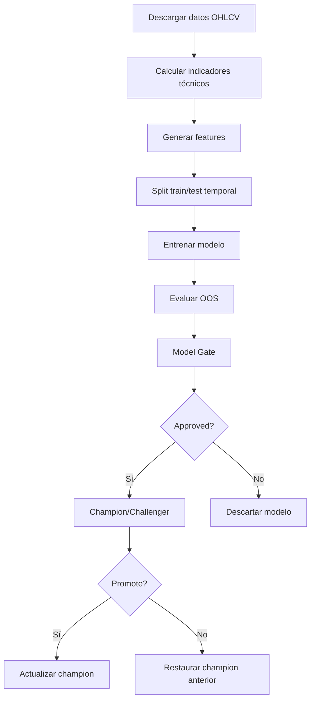

# Pipeline de Machine Learning

## Modelos

| Modelo | Archivo | Algoritmo | Propósito |
|--------|---------|-----------|-----------|
| XGBoost | `ml/train.py` | XGBClassifier | Predicción por ticker (7 modelos) |
| LightGBM Panel | `ml/panel_model.py` | LGBMClassifier | Modelo único cross-sectional con embeddings |
| Neural Brain | `ml/neural_brain.py` | PyTorch NN + RL | Red neuronal con fine-tuning RL |
| RL Agent | `ml/rl_train.py` | Q-Learning | Agente de refuerzo para trading |
| LSTM | `ml/lstm_model.py` | LSTM | Predicción secuencial de precios |
| Adaptive Ensemble | `ml/ensemble.py` | Weighted blending | Combinación dinámica con pesos por régimen |

## Feature Engineering

### Features Técnicas (`ml/features.py`)

```
feat_return_1d, _3d, _5d, _10d  → Retornos históricos
feat_volatility_5d, _10d         → Volatilidad rodante
feat_rsi                          → RSI normalizado [0,1]
feat_macd_diff                    → MACD - Signal
feat_bollinger_pct_b             → %B de Bollinger
feat_dist_sma_20, _50, _200      → Distancia a medias móviles
feat_dist_vwap                   → Distancia a VWAP
feat_cmf                          → Chaikin Money Flow
feat_vol_change                   → Cambio de volumen
feat_macro_spy_return            → Retorno SPY
feat_macro_spy_trend             → SPY vs SMA200
feat_macro_vix                   → Nivel VIX
```

### Features Cross-Sectionales (`ml/panel_model.py`)

```
cs_close_rank    → Percentil del precio en el cross-section
cs_volume_rank   → Percentil del volumen
cs_rsi_rank      → Percentil del RSI
cs_return_rel    → Retorno relativo vs promedio del cross-section
ticker_freq_bin  → Frequency bin del ticker (1-20)
sector_*         → One-hot encoding del sector
ticker_win_rate  → Target encoding rolling (60 días)
```

## Target

La variable objetivo es clasificación binaria:

```
target = 1  si close[t+5] / close[t] - 1 >= 1.5%
target = 0  en caso contrario
```

## Ensemble Adaptativo

### Pesos por Régimen

| Modelo | Bull | Bear | Lateral | High Vol |
|--------|------|------|---------|----------|
| XGBoost | 0.22 | 0.13 | 0.13 | 0.18 |
| Neural Brain | 0.18 | 0.22 | 0.13 | 0.22 |
| RL Agent | 0.09 | 0.18 | 0.13 | 0.13 |
| Online Advisor | 0.13 | 0.18 | 0.18 | 0.13 |
| TA Classic | 0.18 | 0.09 | 0.22 | 0.09 |
| LSTM | 0.09 | 0.09 | 0.09 | 0.13 |
| Panel | 0.11 | 0.11 | 0.12 | 0.12 |

### Ajuste Dinámico

- Cada 10 predicciones se rebalancean los pesos
- Accuracy ponderada por decaimiento exponencial (halflife=10)
- Momentum: pesos no cambian más de 30% por ajuste
- Shrinkage: contracción hacia defaults cuando hay pocas muestras
- Baseline-adjusted: se mide contra predecir la dirección anterior

## Validación

### Model Gate (`ml/model_gate.py`)

```
Criterios de aprobación:
- accuracy  >= 0.55
- precision >= 0.50
- test_size >= 30 muestras OOS
- edge      >= 0.03 (vs baseline naive)
```

### Champion/Challenger (`ml/champion_challenger.py`)

```
- Challenger debe vencer al champion por >= 2pp (PROMO_MARGIN)
- Piso mínimo absoluto: 0.52 accuracy
- Re-entreno si age > 14 días
- Re-entreno si live accuracy < 0.45
```

### Walk-Forward + Monte Carlo (`backtesting/validation.py`)

```
- Expanding window con purging (5 días) y embargo (2 días)
- OOS split final: 15%
- 1000 simulaciones Monte Carlo
- Overfit detection ratio
```

## Pipeline de Entrenamiento


