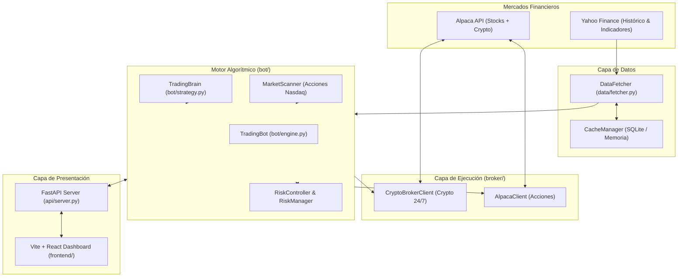

# 01 — Arquitectura y Sistemas de Axiom

Axiom está concebido con una arquitectura orientada a servicios ligeros, capaz de operar tanto localmente en tu computadora como en un contenedor Docker en la nube (Render) con recursos limitados (512 MB a 2 GB de RAM).

---

## 🏛️ Diagrama de Bloques General

---

## 1. El Backend FastAPI (`api/`)

El servidor web está construido sobre **FastAPI** (`api/server.py`), aprovechando la concurrencia nativa de `asyncio`.

* **Gestión de Ciclo de Vida (`lifespan`)**:
  Al arrancar el servidor:
  1. Valida las configuraciones y credenciales de broker.
  2. Limpia caché expirada en disco.
  3. Lanza el watchdog en background (`_watchdog_bot`) que supervisa si el bot está corriendo y lo auto-arranca de forma segura 10 segundos después del inicio.
  4. Mantiene el endpoint de salud (`/health`) para Render.
* **Rutas Principales (`api/routes/`)**:
  * `broker.py`: Estado de la cuenta en Alpaca, posiciones abiertas, órdenes del día y control de arranque/parada del bot.
  * `analysis.py`: Ejecuta escaneos y análisis técnico bajo demanda para cualquier ticker.
  * `market.py`: Amplitud del mercado, régimen HMM y estado del VIX.
  * `ml.py`: Precisión de los modelos de Machine Learning, Drift y telemetría de señales.
  * `portfolio.py`: Métricas de Sharpe, volatilidad y pesos recomendados.

---

## 2. El Frontend Interactivo (`frontend/`)

Ubicado en `frontend/`, es una Single Page Application (SPA) moderna desarrollada con:
* **React 18** y **TypeScript** para un código fuertemente tipado.
* **Vite** como empaquetador ultrarrápido.
* **Tailwind CSS** y componentes oscuros estilo terminal Bloomberg.
* **Lucide Icons** y **Recharts** para graficar curvas de equity, drawdowns y velas japonesas.

Permite monitorear en vivo las posiciones de Alpaca, activar o pausar el bot, ver los scores compuestos y consultar el log de auditoría en tiempo real.

---

## 3. La Capa de Broker (`broker/`)

Axiom desacopla la lógica de toma de decisiones de la ejecución mediante una interfaz abstracta:

1. **`AlpacaClient` (`broker/alpaca_client.py`)**:
   * Utiliza la librería oficial `alpaca-py`.
   * Opera acciones durante el horario oficial de Wall Street (9:30 AM – 4:00 PM EDT).
   * Gestiona órdenes inteligentes (`place_smart_order`), órdenes límite con timeout y órdenes a mercado.
2. **`CryptoBrokerClient` (`broker/crypto_client.py`)**:
   * Especializado en criptomonedas (BTC, ETH, SOL, DOT, etc.).
   * Opera las 24 horas del día, los 7 días de la semana, los 365 días del año.
   * Maneja el cálculo en tiempo real de PnL diario y conexión con el libro de órdenes cripto de Alpaca.
3. **`PaperTradingClient` (`broker/paper_client.py`)**:
   * Simulador local en memoria y SQLite que permite correr tests completos sin necesidad de internet ni credenciales de API.

---

## 4. Pipeline de Datos y Caché (`data/`)

* **`DataFetcher` (`data/fetcher.py`)**:
  * Descarga datos de precios históricos (Open, High, Low, Close, Volume) mediante `yfinance` con reintentos exponenciales.
  * Integra caché inteligente para no saturar las APIs de datos ni agotar el ancho de banda.
* **`CacheManager` (`data/cache_manager.py`)**:
  * Guarda las series descargadas en archivos serializados y SQLite con tiempo de expiración (TTL).
  * Si un activo ya fue consultado en la última hora, se recupera directamente de la memoria o disco, reduciendo el tiempo de escaneo de 2 segundos a 2 milisegundos.

---

## 5. Optimización Extrema para Contenedores de 512 MB (Render Free / Starter)

En Python, el consumo de RAM puede desbordarse fácilmente cuando se procesan cientos de DataFrames de Pandas con indicadores. Axiom implementa varias técnicas avanzadas de ingeniería:

1. **Recolección Forzada y `malloc_trim`**:
   Tras evaluar cada ticker, el sistema invoca explícitamente `del df` y ejecuta `trim_process_memory()`, llamando a la función de sistema C `malloc_trim(0)` en Linux para devolver inmediatamente la memoria al sistema operativo.
2. **Escaneo Secuencial (Streaming)**:
   En lugar de cargar los 25 pares cripto o los 50 tickers de acciones al mismo tiempo en memoria, los procesa uno a la vez.
3. **Punteros de Historial Aislados**:
   Las series temporales para arbitraje estadístico se extraen mediante copias profundas aisladas (`.copy()`), evitando retener en memoria los objetos pesados `BlockManager` de Pandas.
4. **Tipos de Datos Eficientes**:
   Uso de `float32` en indicadores técnicos, lo que reduce el peso de los arrays numéricos en un 50% frente al `float64` estándar de Python.
