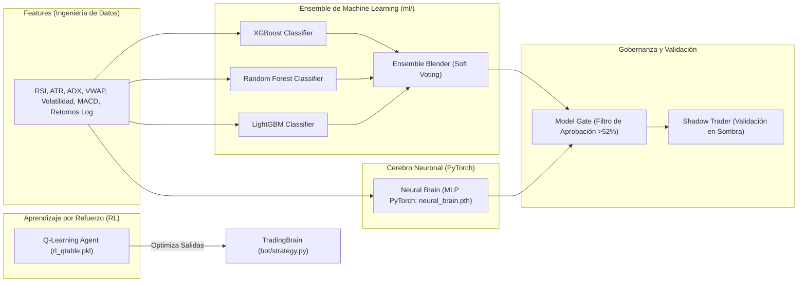

# 03 — Inteligencia Artificial y Machine Learning en Axiom

Axiom no utiliza modelos de lenguaje (LLMs) para predecir precios al azar. En finanzas cuantitativas, los modelos probabilísticos basados en árboles de gradiente (*Gradient Boosting*), redes neuronales profundas (*Deep Learning*) y aprendizaje por refuerzo (*Reinforcement Learning*) son los estándares de la industria para predecir la dirección del precio y optimizar las salidas.

---

## 🧠 Arquitectura de la IA en Axiom

---

## 1. El Ensemble de Machine Learning (`ml/ensemble.py`)

Axiom combina tres algoritmos líderes en predicción tabular:

1. **XGBoost (`XGBClassifier`)**: Excelente para capturar relaciones no lineales y dependencias complejas entre el volumen y los indicadores técnicos.
2. **Random Forest (`RandomForestClassifier`)**: Reduce la varianza y previene el sobreajuste (*overfitting*) combinando múltiples árboles de decisión independientes.
3. **LightGBM / Regresores Lineales**: Aportan velocidad y estabilidad cuando los mercados cambian rápidamente de régimen.

### Votación Suave (*Soft Voting*):
El ensemble calcula una probabilidad ponderada $P(\text{BUY})$:
* Si $P(\text{BUY}) \ge 0.52$ (52% de probabilidad estadística de subida en las próximas velas), el modelo emite señal de compra favorable.
* Si $P(\text{BUY}) < 0.45$, el modelo veta la operación aunque el análisis técnico se vea tentador.

---

## 2. El Cerebro Neuronal (`ml/neural_brain.py`)

Guardado en disco como `data/neural_brain.pth`:
* **Tecnología**: Construido con **PyTorch**.
* **Estructura**: Red neuronal multicapa (MLP) con capas densas, normalización por lotes (*BatchNorm*), funciones de activación LeakyReLU y *Dropout* del 20% para evitar memorizar el pasado.
* **Función**: Clasifica el patrón de mercado actual en una de 3 categorías: Alcista, Bajista o Ruido Lateral.

---

## 3. Aprendizaje por Refuerzo para Salidas Óptimas (`ml/rl_train.py`)

Uno de los problemas más difíciles en trading no es cuándo comprar, sino **cuándo vender**: vender demasiado rápido corta las ganancias; vender demasiado tarde devuelve todo el dinero al mercado.

Axiom cuenta con un agente de **Q-Learning** (`rl_qtable.pkl`):
* **Espacio de Estados**:
  * Tramo de PnL actual ($<-5\%$, $-2\%$ a $0\%$, $+2\%$ a $+5\%$, $>+10\%$).
  * Estado del RSI (sobreventa, neutral, sobrecompra).
  * Régimen de mercado (Bull, Bear, Lateral).
* **Acciones del Agente**:
  * `Acción 0`: **HOLD** (mantener la posición para ganar más).
  * `Acción 1`: **SELL** (cerrar la posición y asegurar el dinero).
* **Función de Recompensa (*Reward*)**:
  El agente es premiado cuando vende cerca del máximo de la curva de precio y castigado si aguanta una posición que termina en pérdida. Con cada trade cerrado, la tabla Q se actualiza automáticamente.

---

## 4. Gobernanza: Shadow Trader y Model Gate

Axiom nunca confía ciegamente en un modelo recién entrenado. Aplica dos filtros de seguridad institucional:

### A. Shadow Trader (`bot/shadow_trader.py`)
Antes de permitir que un modelo opere dinero real o simulación activa:
1. El modelo genera predicciones en "sombra" (*paper shadow*).
2. Se registra el resultado 3, 5 y 10 días después.
3. Se mide la precisión real (*live accuracy*) y el error de calibración (*Brier Score*).

### B. Model Gate (`ml/model_gate.py`)
Es la aduana del sistema:
* **Regla estricta**: Un modelo solo es aprobado para operar si demuestra una **precisión en vivo superior al 52%** en al menos 15 muestras reales.
* **Auto-revocación por Drift**: Si las condiciones macroeconómicas cambian y la precisión del modelo cae por debajo del 50%, el Model Gate revoca el modelo automáticamente y el bot regresa a operar puramente por análisis técnico hasta que el modelo sea re-entrenado.

---

## 5. Ciclo Champion / Challenger

Los mercados financieros evolucionan constantemente (lo que funcionaba en 2024 puede no funcionar en 2026).
* Cada 7 días o cuando se detecta pérdida de precisión (*concept drift*), el motor activa el pipeline `ChampionChallenger`:
  1. Entrena un modelo retador (*Challenger*) con los datos más recientes.
  2. Lo compara frente al modelo actual (*Champion*).
  3. Si el retador supera en métricas de Sharpe y precisión al campeón, toma el relevo automáticamente en producción.
