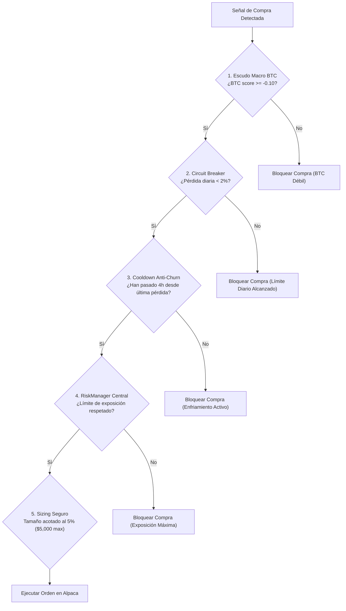

# 04 — Gestión de Riesgo y Escudos de Protección

En el trading algorítmico, **la rentabilidad es una consecuencia directa de la supervivencia**. Si un algoritmo no sabe proteger su capital, un solo día de caos puede destruir meses de ganancias acumuladas.

Este cuaderno documenta todos los escudos institucionales integrados en Axiom tras las lecciones aprendidas en producción.

---

## 🛡️ Matriz de Escudos de Seguridad



---

## 1. Escudo 1: Límite de Tamaño al 5% (Eliminación del Slippage)

* **El problema histórico**: Anteriormente, el bot permitía tamaños de hasta el 25% del portafolio (\$25,000 USD por orden). En altcoins de mediana liquidez en Alpaca Crypto, una orden de mercado de \$25,000 provocaba un deslizamiento (*slippage*) y comisiones de entrada de hasta el 1.5%, iniciando la posición ya en pérdida.
* **La solución en Axiom**:
  * `crypto_max_position_size_pct: 0.05` (5% máximo del capital $\approx \$5,000$ USD).
  * `crypto_min_position_size_pct: 0.02` (2% mínimo).
  * `crypto_target_risk_per_trade_pct: 0.0075` (arriesga solo el 0.75% del capital por operación).

Las órdenes de \$5,000 USD entran instantáneamente y se llenan al precio del libro sin mover el mercado ni sufrir penalización de comisiones.

---

## 2. Escudo 2: Circuit Breaker Diario (Freno de Emergencia al 2%)

* **Ubicación**: [`bot/engine.py`](file:///c:/Users/villa/.gemini/antigravity/scratch/inversion-helper/bot/engine.py) y [`broker/crypto_client.py`](file:///c:/Users/villa/.gemini/antigravity/scratch/inversion-helper/broker/crypto_client.py).
* **Fórmula**: Monitorea el PnL del día en tiempo real:

$$\text{PnL Diario} = \frac{\text{Equity Actual} - \text{Last Equity}}{\text{Last Equity}}$$

* **Regla de Oro**: Si el portafolio sufre un retroceso del **2.0% o más en un solo día**:
  1. Se **bloquean inmediatamente todas las nuevas compras**.
  2. El bot pasa a modo defensivo exclusivo: solo gestiona salidas ordenadas o coberturas de posiciones abiertas.
  3. Previene que rachas perdedoras consecutivas se encadenen y drenen la cuenta.

---

## 3. Escudo 3: El Escudo Macro de Bitcoin (BTC Macro Shield)

En el mercado de criptomonedas, **Bitcoin es el sol del sistema solar**: si Bitcoin se desploma, el 99% de las altcoins caen el doble.

* **Regla algorítmica**:
  Antes de comprar cualquier altcoin (ETH, SOL, AVAX, DOT, NEAR, etc.), Axiom escanea primero `BTC/USD`.
  * Si el Composite Score de Bitcoin es menor a **-0.10** (tendencia bajista o presión de venta institucional en BTC), **la compra de cualquier altcoin queda automáticamente vetada**.
  * Ninguna altcoin puede ser comprada si el rey del mercado está en caída libre.

---

## 4. Escudo 4: Cooldown Anti-Churn y Anti-Cuchillo Cayendo (4 Horas)

* **El problema histórico**: Cuando una moneda era vendida por stop-loss, el bot a veces detectaba un rebote técnico 30 minutos después y volvía a comprar la misma moneda, para volver a ser expulsado por el stop loss, entrando en un bucle destructivo (*churning*).
* **La solución**:
  * Tras **cualquier salida con pérdida** (`pnl_pct < 0`), el símbolo entra en una lista negra temporal durante **4 horas completas (14,400 segundos)**.
  * Ningún algoritmo puede volver a comprar ese activo hasta que hayan pasado 4 horas y el mercado demuestre verdadera estabilidad.

---

## 5. Escudo 5: Stop Loss Dinámico y Adaptativo por ATR

Axiom no utiliza un porcentaje fijo arbitrario (como -2% o -3%) para todas las monedas. Un -2% en Bitcoin es un movimiento considerable, pero en DOT o AVAX un 2% es simple ruido de 10 minutos.

* **Cálculo Matemático (`bot/strategy.py`)**:
  El stop loss se calibra según la volatilidad real del activo:

$$\text{Stop Loss} = -1 \cdot \text{ATR Multiplier} \cdot \left(\frac{\text{ATR}_{14}}{\text{Precio}}\right)$$

* **Límites Seguros (Clamping)**:
  El stop queda acotado dinámicamente entre **-4.0%** (en activos tranquilos) y **-8.0%** (en activos volátiles), evitando que un pico de volatilidad corte la posición prematuramente.

---

## 6. Escudo 6: Chandelier Trailing Stop y Toma Parcial de Ganancias

* **Toma Parcial de Ganancias (Partial Take Profit)**:
  Cuando una posición alcanza un beneficio objetivo (por ejemplo, $+10\%$), el bot vende automáticamente el **50% de la posición**. Esto garantiza que el trade ya es ganador en efectivo real.
* **Chandelier Trailing Stop**:
  El 50% restante sigue corriendo libre. A medida que el precio sube, el Stop Loss va persiguiendo al precio a una distancia de $3 \times \text{ATR}$ desde el máximo alcanzado. Si el precio retrocede, el trailing stop salta y protege las ganancias acumuladas (como ocurrió con **META**, asegurando **+\$2,110 USD de ganancia neta**).

---

## 7. Escudo 7: Protección de HOLD Manual (`manual_hold_symbols`)

A veces, el inversionista posee una tesis de mercado superior y decide que una posición de calidad que cayó temporalmente no debe ser liquidada por el algoritmo de corto plazo.

* **Cómo funciona**:
  En [`bot/strategy_params.py`](file:///c:/Users/villa/.gemini/antigravity/scratch/inversion-helper/bot/strategy_params.py):
  ```python
  manual_hold_symbols: tuple[str, ...] = ("DOT/USD", "DOTUSD")
  ```
* **Efecto en el motor**:
  * Cuando el bot escanea el símbolo, el cerebro emite:
    `Action: HOLD | Reason: HOLD manual activo para DOT-USD (esperando recuperación)`
  * Todas las órdenes automáticas de venta quedan **estrictamente deshabilitadas** para ese activo.
  * **Caso de éxito real**: Esta regla protegió tu posición de DOT cuando estaba en $-\$1,876$ ($-7.5\%$), permitiendo que rebotara limpiamente hasta **$+\$1,736$ USD ($+7.0\%$)**.
